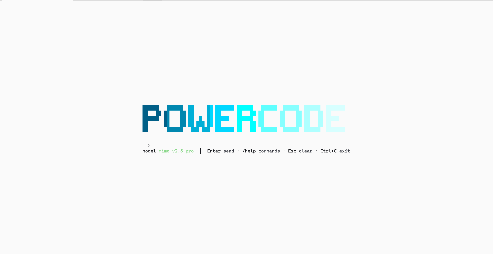
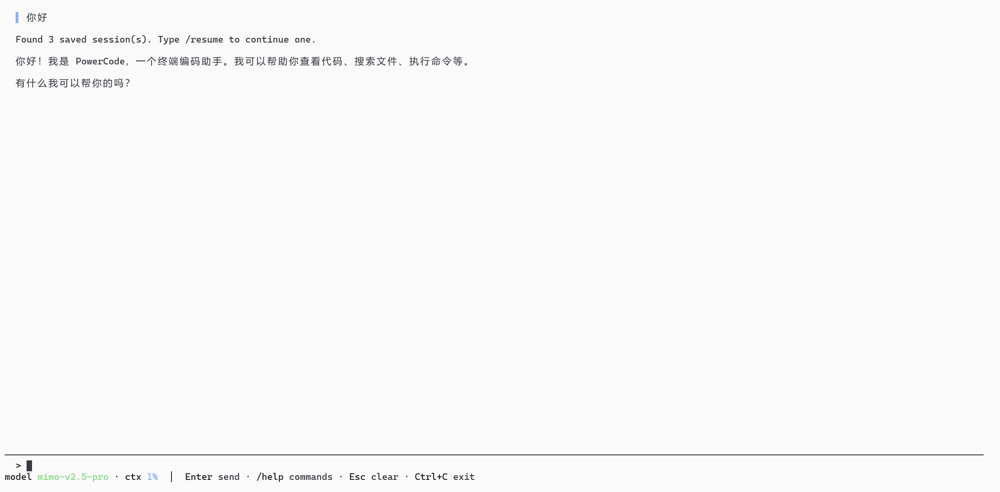

<p align="center">
  
</p>


<h1 align="center">PowerCode</h1>

<p align="center">
  <strong>终端 AI 编程助手</strong>
</p>

<p align="center">
  <a href="#功能特性">功能特性</a> •
  <a href="#快速开始">快速开始</a> •
  <a href="#使用方法">使用方法</a> •
  <a href="#配置说明">配置说明</a> •
  <a href="#开发指南">开发指南</a>
</p>

---

## 简介

PowerCode 是一款强大的终端 AI 编程助手，将大语言模型的能力直接带入你的终端。拥有精美的 TUI 界面、多 Agent 支持和无缝工具集成，彻底改变你的编程方式。

## 界面展示

### 启动界面

<p align="center">
  
</p>

<p align="center">
  <em>启动时展示 Logo、模型信息和输入框，简洁优雅</em>
</p>

### 工作界面

<p align="center">
  
</p>

<p align="center">
  <em>多 Agent 并行执行，实时状态显示，Markdown 渲染</em>
</p>

## 功能特性

### 精美终端界面
- 现代化 TUI 设计，彩色条标记不同类型内容
- 光标闪烁动画，实时状态显示
- 响应式布局，自适应终端大小
- Markdown 渲染，支持语法高亮

### 多 Agent 编排
- 并行运行多个 AI Agent
- 智能任务分解和路由
- 实时 Agent 状态面板
- 自动结果聚合

### 强大工具集成
- 文件读写操作
- Shell 命令执行
- 网页搜索和抓取
- MCP（Model Context Protocol）支持

### 智能上下文管理
- 自动上下文压缩
- 会话持久化和恢复
- 历史记录搜索
- 智能 Token 管理

### 开发者体验
- 键盘优先导航
- 斜杠命令系统
- 命令历史记录
- 剪贴板集成

## 快速开始

### 安装

```bash
npm install -g powercode
```

### 配置

```bash
# 运行安装程序
power --install

# 或手动配置
export ANTHROPIC_API_KEY="your-api-key"
export ANTHROPIC_BASE_URL="https://api.anthropic.com"
```

### 启动

```bash
# 在当前目录启动
power

# 指定模型启动
power --model claude-3-opus-20240229

# 恢复之前的会话
power --resume <session-id>
```

## 使用方法

### 基本交互

```
> 写一个计算斐波那契数列的函数
```

### 斜杠命令

| 命令 | 说明 |
|------|------|
| `/help` | 显示可用命令 |
| `/tools` | 列出可用工具 |
| `/sessions` | 列出保存的会话 |
| `/resume` | 恢复之前的会话 |
| `/new` | 开始新会话 |
| `/compact` | 压缩上下文 |
| `/multi` | 运行多 Agent 任务 |

### 多 Agent 模式

```
> /multi 审查 src/ 下所有模块的安全性并制定修复计划
```

这将会：
1. 将任务分解为子任务
2. 并行运行多个 Agent
3. 将结果聚合为综合报告

### 快捷键

| 按键 | 功能 |
|------|------|
| `Enter` | 发送消息 |
| `Esc` | 清空输入 |
| `Ctrl+C` | 退出 |
| `↑/↓` | 浏览历史 |
| `Tab` | 切换焦点 |

## 配置说明

### 配置文件

位于 `~/.powercode/settings.json`：

```json
{
  "model": "claude-3-opus-20240229",
  "env": {
    "ANTHROPIC_BASE_URL": "https://api.anthropic.com",
    "ANTHROPIC_AUTH_TOKEN": "your-token"
  }
}
```

### MCP 服务器

在 `.powercode/mcp.json` 中配置 MCP 服务器：

```json
{
  "servers": [
    {
      "name": "filesystem",
      "command": "npx",
      "args": ["-y", "@modelcontextprotocol/server-filesystem", "/path"]
    }
  ]
}
```

## 项目架构

```
src/
├── tui/              # 终端 UI 组件
│   ├── chrome.ts     # UI 面板和边框
│   ├── colors.ts     # 颜色系统
│   ├── transcript.ts # 消息渲染
│   ├── markdown.ts   # Markdown 解析
│   └── logo.ts       # 输入面板
├── core/             # 核心 Agent 循环
├── tools/            # 内置工具
├── multi-agent/      # 多 Agent 编排
├── compact/          # 上下文压缩
└── index.ts          # 入口文件
```

## 开发指南

```bash
# 克隆仓库
git clone https://github.com/Uranus-yor/Powercode.git
cd Powercode

# 安装依赖
npm install

# 开发模式运行
npm run dev

# 运行测试
npm test

# 类型检查
npm run check

# 代码检查
npm run lint
```

## 许可证

MIT 许可证 - 详见 [LICENSE](LICENSE)

---

<p align="center">
  使用 ❤️ 构建 · <a href="https://github.com/Uranus-yor">Uranus-yor</a>
</p>
